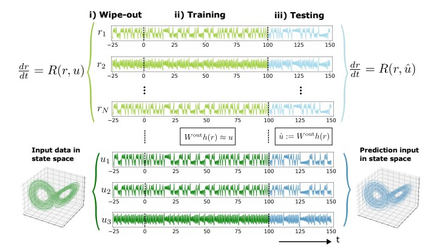
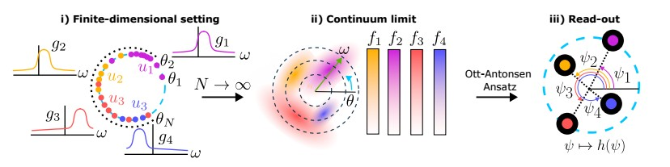

## Utilizing populations of oscillators as a reservoir computer

We investigate a oscillator network based reservoir computer with a large number of oscillators and a low dimensional read-out. The read-out is a function on the average phases with respect to each oscillator population. Hence, this read-out provides a robust measurement of the oscillator states. We consider a low number of populations which leads to a low-dimensional read-out.   Here, the task is time-series prediction. The input time-series is introduced via a forcing term. After a training phase the input is learned. Importantly, the training weights are introduced in the forcing term meaning that the oscillator network is left untouched. Hence, we can apply classical methods for oscillator networks. Here, we consider the continuum limit for Kuramoto oscillators by using the Ott-Antonsen Ansatz.  Consequently, a mean field reservoir computer arises. The success and failure of the reservoir computer is can then be studied by investigating the bifurcations in the coupling and forcing parameter space.

## Schematic set-up

We consider the reservoir computing framework for autonomous time-series prediction. The reservoir evolution is described by a $u$-driven ODE. Here the input is given by a solution of Lorenz system.  

<p align="center">
  
</p>

i) During wipe-out transients are removed by evolving the $u$-driven reservoir. ii) During training the $u$-driven reservoir is also evolved but a linear weight matrix, $W^{\rm out}$ is trained so that the read out of the states, $h(r)$, is fitted to $u$.  iii) During testing the $u$ is substituted by $W^{\rm out}h(r)$ so that the resulting system can predict $u$ autonomously.

The reservoir is taken to be a network of coupled oscillators which are driven by an input $u$. Each oscillator, $\theta_i$ has its own natural frequency $\omega_i$ and is driven by an input component $u_{j_i}$. Note that in our setting a collection of oscillators are driven by the same input component. More specifically, a population of oscillators is driven by the same input and has natural frequencies sampled from a common distribution $g_j(\omega)$. Let $N$ denote the number of oscillators, $P$ the number of oscillator populations and $M$ the dimension of the input. We can then use classical theory to transition from a Finite-Dimensional (FD) oscillator network to a Continuum Limit (CL) oscillator network. 

<p align="center">
  
</p>

Let's make this more explicit with the example above: i) For the FD oscillator network we consider $M=3$ and $P=4$. Note that the  populations driven by $u_3$ are not identical since $g_3,g_4$ are different. ii)  In an infinite dimensional setting we can describe the oscillator populations by density functions over the phases and natural frequencies. iii) Using the Ott-Antonsen Ansatz we reduce our study to the average population dynamics. Specifically, for CL oscillator networks we consider the read-out as a function over the average phases, $\psi$.

## About the repo

This repo contains the code to reproduce the experiments for the manuscript: 

```
@article{dejong2026designinglearning,
  title={Designing learning in high dimensional oscillator networks with low dimensional read-out},
  author={de Jong, Thomas Geert},
  journal={https://arxiv.org/abs/2509.00848},
  year={2026}
}
```
The folder naming is as follows: ` M{x}d_{y} `. The `x` indicates the dimension of the input and the `y` is either `CL`, continuum limit, or `FD`, finite dimensional.  

If this repo was useful to you please cite as

``` 
@misc{reservoir_acceleration,
author={Jong,  T.G. de }, 
  title = {Mean-field reservoir computing},
  year = {2026},
  publisher = {GitHub},
  journal = {GitHub repository},
  howpublished = {\url{https://github.com/mathowl/mean_field_reservoir_computing}},
}
```
